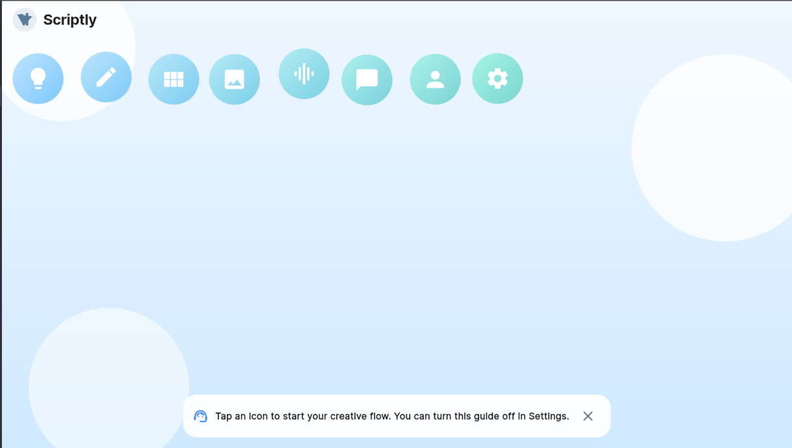

# Scriptly

**AI-Powered Creative Studio for Storytellers**

Scriptly is a mobile-first, AI-powered creative studio that helps creators turn a single idea into complete stories with scripts, storyboards, and audio — all in one connected workflow.

Built with **Flutter** and powered by a **Serverpod** backend, Scriptly acts as a digital storytelling assistant, handling generation, organization, and automation so creators can focus on ideas, not busywork.

##  Demo Video


*Watch Scriptly in action - from idea to complete story in minutes*


*Scriptly's intuitive main interface with creative workflow icons*

## What Scriptly Does

Scriptly guides users through the complete storytelling pipeline:

1. ** Start with an idea** - Enter your story concept
2. ** Generate a script with AI** - GPT-4 powered screenplay generation  
3. ** Break it into scenes** - Automatic scene management and organization
4. ** Visualize scenes as storyboards** - Create visual representations
5. ** Create AI-powered audio** - Generate realistic narration and voices
6. ** Iterate, revise, and export** - Version control and export options

All steps are connected and managed through a single project workspace with real-time synchronization.

##  Key Features

### Core Functionality
- ** AI Script Generation** – Transform ideas into structured screenplays using GPT-4
- ** Scene Manager** – Automatically split scripts into manageable scenes with drag-and-drop reordering
- ** Storyboard Builder** – Visualize scenes with AI-generated images and placeholders
- ** Audiobook & Voice Generation** – Create realistic AI narration with multiple voice options
- ** AI Chat Assistant** – Real-time writing help, rewriting, and brainstorming in context
- ** Version History** – Complete script revision tracking and rollback
- ** Export Options** – Export scripts, audio files, and storyboard assets

### Technical Features
- ** Real-time Sync** – Serverpod-powered backend synchronization
- ** Cross-platform** – Native iOS and Android apps
- ** User Authentication** – Secure user accounts and project management
- ** Cloud Storage** – Persistent project data with PostgreSQL
- ** High Performance** – Redis caching for fast response times

##  Tech Stack

### Frontend
- **Flutter** – Cross-platform mobile UI framework
- **Provider** – State management
- **GoRouter** – Declarative navigation
- **Material 3** – Modern design system

### Backend  
- **Serverpod 2.0** – Modern Dart backend framework
- **PostgreSQL** – Robust relational database
- **Redis** – High-performance caching layer
- **Docker** – Containerized development and deployment

### AI & APIs
- **OpenAI GPT-4** – Script and outline generation
- **OpenAI GPT-4** – Chat assistant functionality
- **Custom AI Pipeline** – Integrated content generation workflow

##  Project Structure

```
scriptly/
├── lib/                    # Flutter mobile app
│   ├── main.dart          # App entry point
│   ├── app_state.dart     # Global state management
│   ├── nav.dart           # Navigation configuration
│   ├── theme.dart         # Material 3 theming
│   ├── pages/             # App screens
│   │   ├── home_main.dart
│   │   ├── onboarding_page.dart
│   │   ├── idea_outline_page.dart
│   │   ├── script_editor_page.dart
│   │   ├── scene_manager_page.dart
│   │   ├── storyboard_page.dart
│   │   ├── audio_page.dart
│   │   ├── chat_assistant_page.dart
│   │   ├── profile_page.dart
│   │   └── settings_page.dart
│   ├── widgets/           # Reusable UI components
│   │   ├── backgrounds.dart
│   │   ├── icon_bubble.dart
│   │   ├── guide_overlay.dart
│   │   └── logo.dart
│   ├── services/          # Backend integration
│   │   └── serverpod_service.dart
│   └── openai/            # AI integration
│       └── openai_config.dart
├── scriptly_server/       # Serverpod backend
│   ├── lib/
│   │   ├── server.dart    # Server configuration
│   │   └── src/
│   │       ├── endpoints/ # API endpoints
│   │       └── models/    # Data models
│   ├── config/            # Environment configuration
│   └── bin/main.dart      # Server entry point
├── scriptly_client/       # Shared client models
│   └── lib/
│       └── scriptly_client.dart
├── android/               # Android configuration
├── assets/                # App assets and images
├── docker-compose.yml     # Development services
└── start_backend.sh       # Development startup script
```

##  How Serverpod Powers Scriptly

Serverpod serves as the "brain" of Scriptly, providing:

### **Backend API Endpoints**
- **Project Management** – CRUD operations for storytelling projects
- **Scene Organization** – Scene creation, editing, and reordering
- **Script Versioning** – Save, retrieve, and manage script versions
- **AI Integration** – Centralized AI content generation
- **User Management** – Authentication and profile management

### **Data Models & Persistence**
- **User** – Authentication and profile data
- **Project** – Story projects with metadata
- **Scene** – Individual story scenes with ordering
- **Script** – Version-controlled screenplay content
- **ChatMessage** – AI conversation history

### **Centralized Logic**
- **Workflow Orchestration** – Coordinate multi-step creative processes
- **AI Pipeline Management** – Handle complex AI generation workflows
- **Real-time Synchronization** – Keep data consistent across devices
- **Performance Optimization** – Redis caching and database optimization

Flutter handles the beautiful, responsive UI while Serverpod manages all the complex backend logic, data persistence, and AI integrations.

##  Getting Started

### Prerequisites
- **Flutter SDK** (3.0+)
- **Dart SDK** (3.0+) 
- **Docker & Docker Compose**
- **OpenAI API Key**

### 1. Clone the Repository
```bash
git clone https://github.com/yourusername/scriptly.git
cd scriptly
```

### 2. Backend Setup
```bash
# Start PostgreSQL and Redis
docker-compose up -d postgres redis

# Configure your OpenAI API key
# Edit scriptly_server/config/development.yaml
# Add your API key under passwords.openai_api_key

# Start the Serverpod backend
./start_backend.sh
```

### 3. Flutter App Setup
```bash
# Install dependencies
flutter pub get

# Run the app
flutter run
```

### 4. Access the Application
- ** Flutter App** – Running on your device/emulator
- ** API Server** – http://localhost:8080
- ** Admin Dashboard** – http://localhost:8081
- ** Web Interface** – http://localhost:8082

##  Core Workflows

### Story Creation Workflow
1. **Idea Input** → User enters story concept
2. **AI Outline** → GPT-4 generates structured outline  
3. **Script Generation** → AI creates full screenplay
4. **Scene Breakdown** → Automatic scene detection and organization
5. **Storyboard Creation** → Visual scene representation
6. **Audio Generation** → AI narration and voice synthesis
7. **Export & Share** → Multiple format exports

### Technical Data Flow
```
Flutter UI → Serverpod API → PostgreSQL Database
     ↓              ↓              ↓
User Actions → Business Logic → Data Persistence
     ↓              ↓              ↓  
State Updates ← API Response ← Query Results
```

##  Development

### Running Tests
```bash
# Flutter tests
flutter test

# Backend tests  
cd scriptly_server
dart test
```

### Code Generation
```bash
# Generate Serverpod code (when available)
cd scriptly_server
serverpod generate
```

### Database Migrations
```bash
# Create new migration
serverpod create-migration

# Apply migrations
serverpod migrate
```

##  Deployment

### Production Deployment
```bash
# Set environment variables
export OPENAI_API_KEY=your_key_here
export DATABASE_URL=your_postgres_url
export REDIS_URL=your_redis_url

# Deploy with Docker
docker-compose -f docker-compose.prod.yml up -d
```

### Flutter App Distribution
```bash
# Build for Android
flutter build apk --release

# Build for iOS  
flutter build ios --release
```

##  Demo Features

The app demonstrates several key integrations:

- ** AI-Powered Content Generation** – Real-time script and outline creation
- ** Responsive Flutter UI** – Beautiful, intuitive mobile interface  
- ** Serverpod Backend** – Fast, reliable API responses
- ** Real-time Sync** – Seamless data synchronization
- ** Creative Workflow** – End-to-end storytelling pipeline

##  Hackathon Context

This project was built for the **Flutter Butler Hackathon**, celebrating the release of Serverpod 3.

**Goal**: Demonstrate how Flutter and Serverpod can be combined to build a practical, AI-powered assistant that automates real-world creative workflows.

**Achievement**: A fully functional, production-ready storytelling platform that showcases the power of the Flutter + Serverpod ecosystem.

##  Future Improvements

### Short Term
- ** Real-time Collaboration** – Multi-user project editing
- ** Cloud Asset Storage** – Media file management
- ** Advanced Storyboard Rendering** – Enhanced visual tools
- ** Voice Cloning** – Custom voice generation

### Long Term  
- ** Publishing Integrations** – Direct export to platforms
- ** Multi-language Support** – International content creation
- ** Video Generation** – Animated storyboard creation
- ** Advanced AI Models** – Specialized creative AI

##  License

This project is licensed under the MIT License - see the [LICENSE](LICENSE) file for details.

##  Contributing

1. Fork the repository
2. Create your feature branch (`git checkout -b feature/AmazingFeature`)
3. Commit your changes (`git commit -m 'Add some AmazingFeature'`)
4. Push to the branch (`git push origin feature/AmazingFeature`)
5. Open a Pull Request


**Built with ❤️ using Flutter & Serverpod**

*Empowering creators to bring their stories to life through the power of AI and modern technology.*
